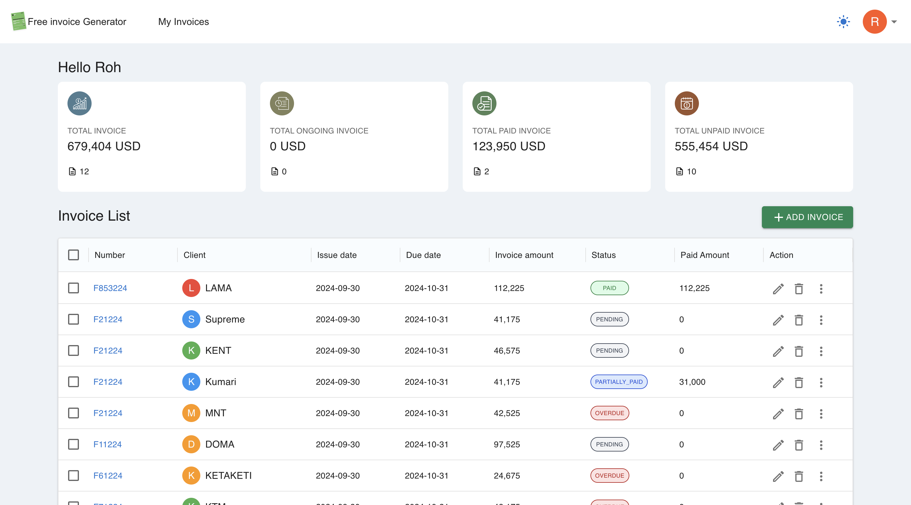
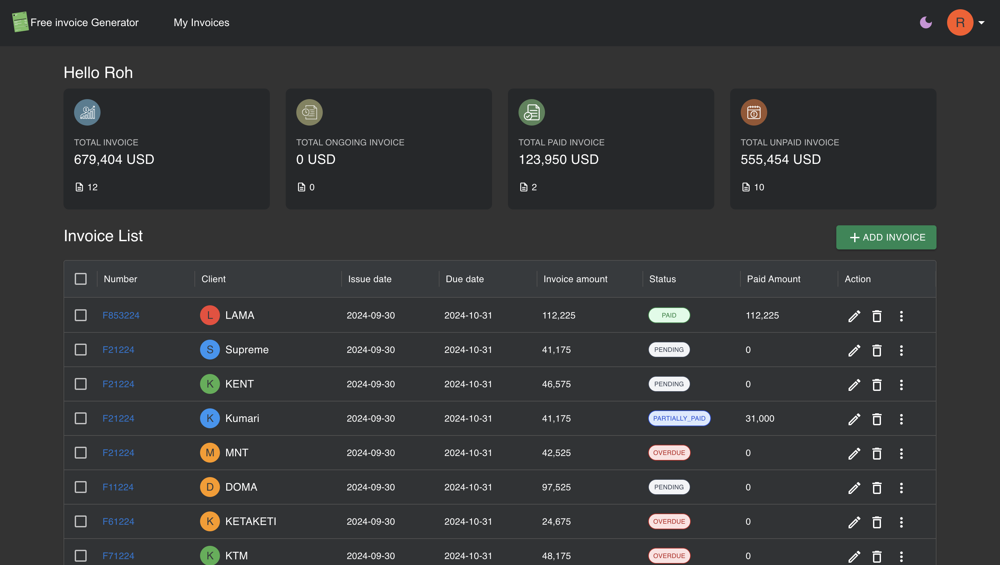
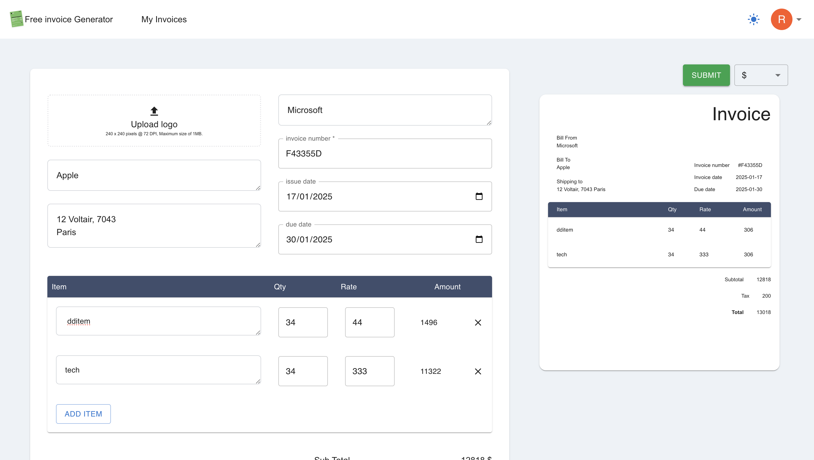

# Myk-Invoice

**Myk-Invoice** is a React Next.js application designed to help users quickly generate, manage, and organize invoices in PDF format. With features like creating, updating, and deleting invoices, and an account-based system for managing them, Myk-Invoice provides a streamlined solution for invoice management.

---

## Features

- **Create New Invoices**: Easily generate detailed invoices in PDF format.
- **Update Existing Invoices**: Edit your invoices at any time.
- **Delete Invoices**: Remove outdated or incorrect invoices.
- **User Authentication**: Sign up or log in to securely manage your invoices.
- **Responsive Design**: Fully functional on desktops, tablets, and mobile devices.

---

## Technology Stack

- **Framework**: [Next.js](https://nextjs.org/) for server-side rendering and routing.
- **Language**: [TypeScript](https://www.typescriptlang.org/) for type-safe development.
- **Styling**: [Tailwind CSS](https://tailwindcss.com/) for utility-first CSS and [Material-UI (MUI)](https://mui.com/) for rich UI components.
- **Data Fetching**: [React Query](https://tanstack.com/query) for efficient server state management.

---

## Installation

### Prerequisites

Ensure you have the following installed:

- [Node.js](https://nodejs.org/) (v14 or higher)
- npm or [yarn](https://yarnpkg.com/)

### Steps

1. Clone the repository:

   ```bash
   git clone https://github.com/yourusername/myk-invoice.git
   ```

2. Navigate to the project directory:

   ```bash
   cd myk-invoice
   ```

3. Install dependencies:

   ```bash
   npm install
   # or
   yarn install
   ```

4. Create a `.env.local` file in the root directory and add necessary environment variables:

   ```env
   NEXT_PUBLIC_API_URL=<your-api-url>
   NEXTAUTH_SECRET=<your-nextauth-secret>
   NEXT_PUBLIC_SITE_URL=<your-site-url>
   ```

5. Start the development server:

   ```bash
   npm run dev
   # or
   yarn dev
   ```

6. Open your browser and visit:
   ```
   http://localhost:3000
   ```

---

## Screenshots

### Dashboard Light



### Dashboard Dark



### Create Invoice



> Screenshots are stored in the `/public` directory.

---

## Scripts

- **`dev`**: Start the development server.
- **`build`**: Build the app for production.
- **`start`**: Start the production server.
- **`lint`**: Run ESLint for code quality checks.

---

## License

This project is licensed under the MIT License. See the [LICENSE](LICENSE) file for more details.

---

## Contribution

Contributions are welcome! To contribute:

1. Fork the repository.
2. Create a feature branch.
3. Commit your changes.
4. Open a pull request.

---

## Acknowledgements

- [Next.js Documentation](https://nextjs.org/docs)
- [TypeScript Handbook](https://www.typescriptlang.org/docs/)
- [Tailwind CSS Documentation](https://tailwindcss.com/docs)
- [Material-UI Documentation](https://mui.com/getting-started/)
- [React Query Documentation](https://tanstack.com/query/latest/docs)

---

Thank you for using **Myk-Invoice**! 😊
